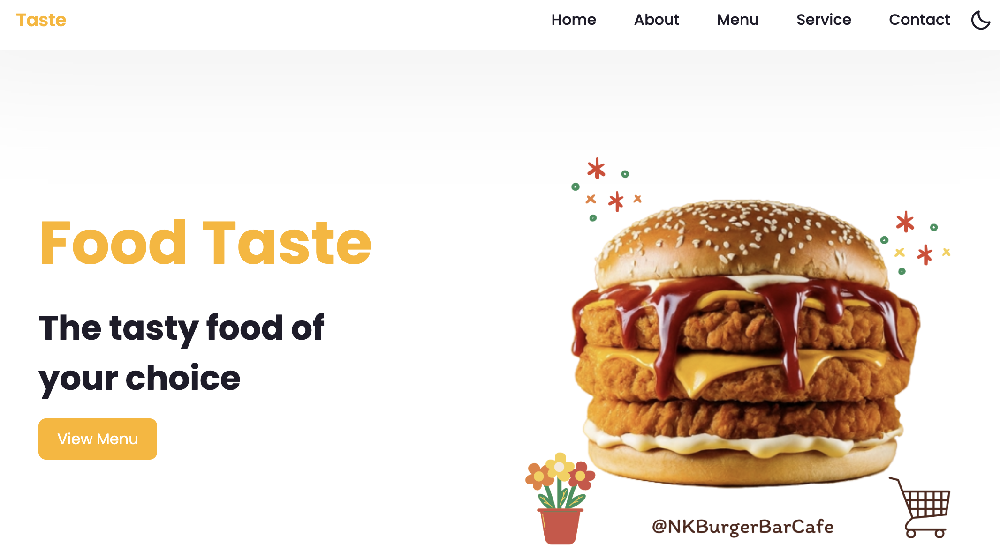

# Burger Bar Cafe

Welcome to the Burger Bar Cafe website! This repository contains the source code for the website of Burger Bar Cafe, showcasing our menu, services, and more.

## Project Overview

This project includes a single-page website designed for Burger Bar Cafe. It features sections for home, about us, menu, services, contact information, and social media links. The site is built using HTML, CSS, JS and includes third-party libraries for icons and fonts.

## Features

- **Responsive Navbar:** A navigation bar that adjusts to different screen sizes.
- **Home Section:** Introduction with a call-to-action button.
- **About Section:** Information about the cafe.
- **Menu Section:** Highlights of the weekly menu.
- **Services Section:** Details of the services provided.
- **Contact Section:** Contact details and links to social media.
- **Footer:** Includes copyright and quick links.

## Project Structure

```
/
├── images/
│   ├── about.jpg
│   ├── delivery-truck.png
│   ├── home.png
│   ├── menu1.png
│   ├── menu2.png
│   ├── menu3.png
│   ├── order.png
│   └── shipping.png
├── style.css
├── main.js
└── index.html
```

### Files

- `index.html`: The main HTML file that contains the structure of the webpage.
- `style.css`: The stylesheet for styling the HTML content.
- `main.js`: JavaScript file for interactive functionality (e.g., dark mode toggle, menu interactions).
- `images/`: Directory containing images used on the website.

## Installation

To view or edit this project, follow these steps:

1. **Clone the Repository**

   ```bash
   git clone https://github.com/worachat-dev/Burger-Bar-Restaurant-Website-Projects01-FED.git
   ```

2. **Navigate to the Project Directory**

   ```bash
   cd Burger-Bar-Restaurant-Website-Projects01-FED
   ```

3. **Open `index.html` in a Browser**

   Simply open `index.html` in your preferred web browser to view the website.

## Dependencies

This project uses the following external libraries:

- [Font Awesome](https://cdnjs.com/libraries/font-awesome) for icons.
- [Boxicons](https://unpkg.com/boxicons@latest/css/boxicons.min.css) for additional icons.
- [Google Fonts](https://fonts.google.com/specimen/Montserrat) for the Montserrat font.
- [ScrollReveal](https://unpkg.com/scrollreveal) for scroll animations.

## Customization

Feel free to customize the styles in `style.css` and functionality in `main.js` as per your needs. Update the content in `index.html` to reflect any changes or additional information.

## Contributing

If you wish to contribute to this project, please fork the repository and submit a pull request with your changes. Make sure to follow the coding standards and provide a clear description of your modifications.

## License

This project is licensed under the MIT License. See the [LICENSE](LICENSE) file for details.

## Acknowledgements

This project was inspired by and includes code from the [Responsive Restaurant/Food Website Design Using HTML CSS And JavaScript - Dark/Light Mode](https://github.com/carpoolvenom/Responsive-Restaurant-Food-Website-Design-Using-HTML-CSS-And-JavaScript---Dark-Light-Mode.git) by CarpoolVenom. Special thanks to CarpoolVenom for their work which served as a foundational reference for this design.

## Screenshots



## Contact

For any inquiries or issues, please contact me!

## Author

- **Worachat W, Dev.** - *Data Science, Engineering & Full Stack Dev. 2024*  
  [LinkedIn](https://www.linkedin.com/in/brainwaves-your-ai-playground-82155961/) | [GitHub](https://github.com/worachat-dev) | [Facebook](https://web.facebook.com/NutriCious.Thailand)


---
Thank you for visiting Burger Bar Cafe's website repository!


